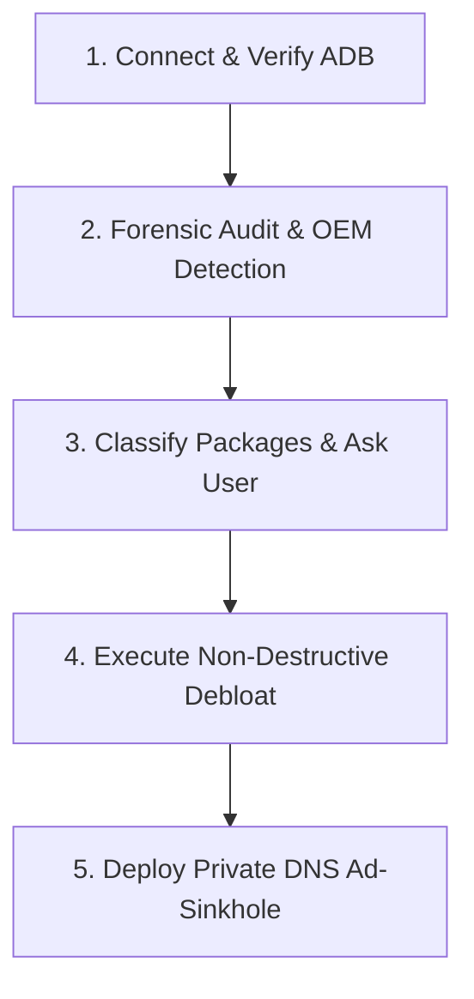

# Android Sanitizer & Adware Remediation

Comprehensive agent skill to audit, diagnose, clean, and protect Android devices connected via ADB. Designed especially for resolving intrusive pop-ups, push-notification spam, rogue WebAPKs, predatory manufacturer ad servers (Xiaomi MSA, GetApps, Samsung Free, etc.), and in-app ads while preserving user data and essential applications.

## Key Capabilities

1. **Elderly Care & Casual User Protection**: Keeps harmless casual games (Mahjong, Candy Crush, Solitaire) and banking/medical apps intact while silencing their ads via Private DNS sinkhole.
2. **Aggressive Performance Debloat**: Deep-cleans older devices, stripping duplicate video apps, preloaded bloat, analytics, and OEM telemetry to free RAM and CPU.
3. **Hardware & Battery Health Diagnostics**: Audits battery capacity (learned vs. design mAh), wear percentage, thermal throttling status, and RAM/storage utilization.
4. **Real-Time Forensic Catching**: Detects which package is popping up on screen right at the moment an ad appears (`mCurrentFocus` / `mFocusedApp`).
5. **Permission & Overlay Auditing**: Identifies apps abusing `SYSTEM_ALERT_WINDOW` (drawing over other apps) and Accessibility Services.
6. **OEM Bloatware Catalog**: Curated database for Xiaomi (HyperOS/MIUI), Samsung (One UI), Motorola, and Transsion (Infinix/Tecno).
7. **Private DNS Sinkhole Guidance**: Automates opening the native Android Private DNS screen to configure AdGuard (`dns.adguard-dns.com`), stopping in-app ads at the network level.

---

## Triage Workflow

Follow this 5-step workflow whenever diagnosing a device:



### Step 1: Detect Device & Environment

Run:
```bash
adb devices -l
adb shell "getprop ro.product.manufacturer; getprop ro.product.model; getprop ro.build.version.release"
```

Verify that the device is authorized (`device` status). If `unauthorized`, prompt the user to unlock the phone and accept the RSA USB debugging prompt.

---

### Step 2: Forensic Audit (Find the Culprits)

Run diagnostic queries to find where pop-ups and notifications originate:

#### A. Real-Time Ad Catcher (When an ad is on screen)
If the user says an ad just popped up:
```bash
adb shell "dumpsys window | grep -E 'mCurrentFocus|mFocusedApp'"
```

#### B. Audit Apps with Overlay Permissions (`SYSTEM_ALERT_WINDOW`)
Apps that draw floating windows or push fullscreen takeovers over other apps:
```bash
adb shell "cmd appops query-op SYSTEM_ALERT_WINDOW allow"
```

#### C. Audit Third-Party & WebAPK Packages
```bash
adb shell "pm list packages -3 -f"
# Check for rogue WebAPKs (PWAs installed from suspicious websites via Chrome)
adb shell "pm list packages | grep webapk"
```

#### D. Audit Notification Spammers
```bash
adb shell "dumpsys notification --noredact" | grep -E "pkg=|NotificationRecord"
```

---

### Step 3: Categorization & User Alignment

Group packages into clear buckets before touching anything:

| Category | Description | Examples | Action |
| :--- | :--- | :--- | :--- |
| **SAFEGUARD** | Personal, banking, medical, messaging, authenticators | WhatsApp, Itaú, Gov.br, Meu INSS, Fleury, Photos | **DO NOT TOUCH** |
| **PRESERVE & SINKHOLE** | Casual games user enjoys, but filled with aggressive ads | Candy Crush, Mahjong Tile, Solitaire | **KEEP, neutralize via DNS** |
| **OEM AD ENGINES** | Built-in vendor ad engines & app recommendation stores | Xiaomi MSA, GetApps, Game Center, App Vault | **UNINSTALL (User 0)** |
| **ROGUE ADWARE / BLOAT** | Malicious cleaners, battery boosters, preloaded junk | Fake cleaners, Amazon AppManager, WPS Lite | **UNINSTALL (User 0)** |

Always confirm with the user before uninstalling.

---

### Step 4: Remediation (Safe User-Space Removal)

Execute uninstallation in user-space (`--user 0`). This is 100% reversible (factory reset or `cmd package install-existing` restores them) and does not break Android system updates.

```bash
# Safe package removal
adb shell "pm uninstall -k --user 0 <PACKAGE_NAME>"
```

### OEM Quick-Reference:

#### Xiaomi / Redmi / POCO (HyperOS & MIUI)
```bash
# Ad servers & Recommendation stores
adb shell "pm uninstall -k --user 0 com.miui.msa.global"        # MIUI System Ads
adb shell "pm uninstall -k --user 0 com.mi.appfinder"           # GetApps / AppFinder
adb shell "pm uninstall -k --user 0 com.xiaomi.mipicks"         # Mi Picks (GetApps)
adb shell "pm uninstall -k --user 0 com.xiaomi.glgm"            # Xiaomi Game Center
adb shell "pm uninstall -k --user 0 com.xiaomi.discover"        # Xiaomi Discover
adb shell "pm uninstall -k --user 0 com.miui.analytics"         # Analytics tracking
adb shell "pm uninstall -k --user 0 com.mi.globalminusscreen"   # App Vault (Left Screen)
adb shell "pm uninstall -k --user 0 com.mi.globalbrowser"       # Mi Browser (spams news/ads)
adb shell "pm uninstall -k --user 0 cn.wps.xiaomi.abroad.lite"  # WPS Lite (pop-ups)
adb shell "pm uninstall -k --user 0 com.miui.videoplayer"       # Mi Video clickbaits
adb shell "pm uninstall -k --user 0 com.miui.player"            # Mi Music clickbaits
adb shell "pm uninstall -k --user 0 com.amazon.appmanager"      # Preloaded partner bloat
adb shell "pm uninstall -k --user 0 com.facebook.appmanager"    # Facebook background updater
adb shell "pm uninstall -k --user 0 com.facebook.system"        # Facebook system service
adb shell "pm uninstall -k --user 0 com.facebook.services"      # Facebook background service
```

#### Samsung (One UI)
```bash
adb shell "pm uninstall -k --user 0 com.samsung.android.app.spage"     # Samsung Free / Daily (news & ads)
adb shell "pm uninstall -k --user 0 com.samsung.android.game.gamehome" # Game Launcher (ad banners)
adb shell "pm uninstall -k --user 0 com.sec.android.app.sbrowser"      # Samsung Internet (if using Chrome)
adb shell "pm uninstall -k --user 0 com.samsung.android.service.livedrawing"
```

---

### Step 5: Network Ad-Sinkhole (Private DNS)

Configuring Private DNS to AdGuard blocks 95%+ of video interstitials, pop-ups, and trackers without battery drain or VPN profiles.

#### Direct Intent Launch (Brings settings screen directly to user's hands):
```bash
adb shell am start -W -a android.settings.WIRELESS_SETTINGS
```

#### Guide the User:
1. Select **"Nome do host do provedor de DNS privado"** (Private DNS provider hostname).
2. Enter:
   ```text
   dns.adguard-dns.com
   ```
3. Tap **Salvar** (Save).

#### Verification Command:
Verify directly from ADB that ads are sinkholed to `127.0.0.1`:
```bash
adb shell "settings get global private_dns_mode; settings get global private_dns_specifier"
adb shell "ping -c 1 pagead2.googlesyndication.com"
```
*(Expected output: ping target resolves to `127.0.0.1`)*

---

### Step 6: Home Screen Hygiene (Xiaomi / HyperOS)
Instruct the user to disable **"Aplicativos promovidos"** (Promoted apps):
- Open any home screen folder (e.g. "Ferramentas", "Mais aplicativos").
- Tap the **folder title**.
- Toggle OFF **"Aplicativos promovidos"**.
