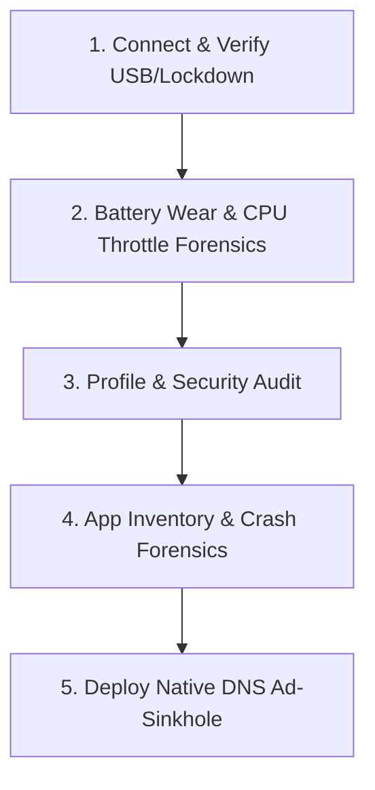

# iOS Sanitizer & Performance Diagnostics

Comprehensive agent skill to audit, diagnose, clean, and protect Apple iOS devices (iPhone, iPad) connected via USB or Wi-Fi Lockdown. Built to resolve hardware battery throttling, deceptive calendar invites, predatory subscription apps, rogue configuration profiles (.mobileconfig), intrusive video ads, and application performance bottlenecks without requiring Jailbreak.

## Key Capabilities

1. **Hardware Battery Health & CPU Throttling Forensics**: Apple masks exact charge cycles on most iPhone models. The skill interfaces directly with the Battery Management System (BMS) through IORegistry (`AppleSmartIOBattery`) to extract raw cycle count, factory design mAh, true nominal capacity, and battery temperature. It diagnoses whether iOS has activated **Dynamic Performance Management (CPU Downclocking)** due to battery cell degradation.
2. **Hardware Stability & Kernel Panic Forensics**: Audits the `/Panics` directory and diagnostic reports for `panic-full` (kernel crashes indicating board/component hardware failures) and `JetsamEvent` (RAM exhaustion crashes caused by bloated apps or webviews).
3. **Application Inventory & Residual Migration Purge**: Catalogs installed third-party apps, detects residual migration tools (e.g. `CopyMyData`) and uninstalls predatory or unneeded apps via `pymobiledevice3 apps uninstall`.
4. **Malicious Configuration Profile & Certificate Auditing**: Identifies rogue MDM payloads, third-party VPN roots, and APN proxies that hijack user traffic or push corporate restrictions.
5. **Native Ad-Sinkhole via Encrypted DNS Profile (`.mobileconfig`)**: Generates and serves an Apple-compliant Configuration Profile using DNS-over-HTTPS (AdGuard DoH). Blocks 100% of banner ads, trackers, and casual game video ads natively at the system resolver level—zero background VPN apps, zero battery degradation.
6. **No Jailbreak Required**: Operates entirely over Apple's official `usbmuxd` / Lockdown Protocol.

---

## Architecture: iOS vs. Android Sanitization

| Vector | Android (Open Architecture) | iOS (Sandboxed Architecture) | iOS Remediation Strategy |
| :--- | :--- | :--- | :--- |
| **Performance Bottleneck** | Rogue background services, bloatware, UI overlays | Battery wear -> iOS Dynamic CPU Downclocking | Audit BMS cycles & mAh; advise battery replacement or toggle throttle |
| **System Spam** | Lockscreen carousels, manufacturer bloat (MSA, GetApps) | Malicious CalDAV calendar subscriptions | Audit and purge calendar subscriptions & profiles |
| **Traffic Hijacking**| Untrusted APKs, local proxy apps | Malicious `.mobileconfig` profiles & rogue certificates | Audit with `pymobiledevice3 profile list` |
| **Battery Diagnostics** | `dumpsys battery` / sysfs nodes | IORegistry `AppleSmartIOBattery` via DiagnosticsService | Query raw cycle count & nominal charge capacity |
| **Crash Forensics** | Logcat & DropBox tombstones (`mm-pp-dpps`) | DiagnosticReports `/Panics` and `JetsamEvent` | Query CrashReportsManager for hardware and RAM collapses |

---

## 5-Step Triage Workflow



### Step 1: Detect Device & Handshake

Verify that `usbmuxd` is running and the device is paired:

```powershell
powershell -ExecutionPolicy Bypass -File "C:\Users\dio\.agents\skills\ios-sanitizer\scripts\triage.ps1"
```

If the device is unlisted or unauthorized:
1. Ensure the iPhone screen is unlocked (iOS locks USB data pins when asleep).
2. Accept the prompt: **"Confiar neste Computador?"** and type the passcode.
3. Ensure the cable is a data-capable cable (compliant with USB-IF specs; beware of charge-only or non-standard cables).

---

### Step 2: Battery Wear & CPU Throttle Forensics

Extract the actual battery health directly from the hardware:

```powershell
& "C:\Users\dio\AppData\Local\Programs\Python\Python312\python.exe" "C:\Users\dio\.agents\skills\ios-sanitizer\scripts\triage_helper.py" "battery"
```

**Evaluation Matrix:**
- **CycleCount > 500**: Apple standard end-of-life benchmark.
- **CycleCount > 1000 or Health < 80%**: Severe degradation. The iOS power governor automatically applies **Dynamic Performance Management**, severely capping CPU clock speeds (downclocking by up to 50%) to prevent voltage sag brownouts.
- **Remediation**:
  - *Immediate work-around*: Disable performance management in *Ajustes > Bateria > Saúde da Bateria* (restores full speed, but risks sudden shutdowns at low SoC).
  - *Definitive fix*: Physical battery replacement (restores factory design mAh and full A-series SoC performance).

---

### Step 3: Profile & Security Audit

Inspect installed configuration profiles to detect rogue VPNs, proxies, or malicious tracking:

```powershell
& "C:\Users\dio\AppData\Local\Programs\Python\Python312\python.exe" -m pymobiledevice3 profile list
```

If suspicious profiles are present:
```powershell
& "C:\Users\dio\AppData\Local\Programs\Python\Python312\python.exe" -m pymobiledevice3 profile remove "<ProfileIdentifier>"
```

---

### Step 4: App Inventory & Crash Forensics

List third-party applications to identify residual migration tools or predatory cleaners:

```powershell
& "C:\Users\dio\AppData\Local\Programs\Python\Python312\python.exe" "C:\Users\dio\.agents\skills\ios-sanitizer\scripts\triage_helper.py" "apps"
```

To remove residual apps (e.g., `CopyMyData` after a completed phone migration):
```powershell
& "C:\Users\dio\AppData\Local\Programs\Python\Python312\python.exe" -m pymobiledevice3 apps uninstall "com.mediamushroom.copymydata2"
```

Audit kernel crashes and memory pressure:
```powershell
& "C:\Users\dio\AppData\Local\Programs\Python\Python312\python.exe" "C:\Users\dio\.agents\skills\ios-sanitizer\scripts\triage_helper.py" "crashes"
```

- **Empty `/Panics`**: Confirms CPU, RAM, NAND, and Baseband are 100% physically stable.
- **JetsamEvent**: Indicates memory exhaustion events.

---

### Step 5: Deploy Encrypted DNS Ad-Sinkhole

To eliminate video and banner ads across apps and Safari without installing third-party VPN apps:

1. Launch the local profile server:
```powershell
& "C:\Users\dio\AppData\Local\Programs\Python\Python312\python.exe" "C:\Users\dio\.agents\skills\ios-sanitizer\scripts\serve_profile.py"
```
2. On the iPhone, open **Safari** and visit the printed LAN IP (`http://<LAN_IP>:8080/adguard.mobileconfig`).
3. Tap **Permitir** (Allow).
4. On iPhone, navigate to **Ajustes > Perfil Baixado > Instalar** and enter passcode.
