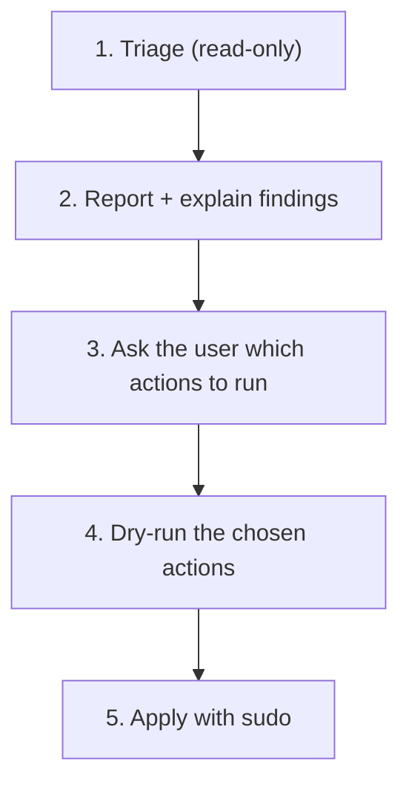

# Linux Sanitizer (Linux + WSL)

Read-only triage, then a dry-run-first remediation for Ubuntu/Debian systems, including distros running under WSL. Optimized for multi-harness agents (Antigravity, Claude Code, Codex, Cursor, Orca). Never deletes user data, never touches kernel/bootloader, never disables arbitrary services.

## Scope
- **Supported:** Debian/Ubuntu (apt). Other distros get the generic checks; package actions are skipped.
- **Environments:** `baremetal`, `vm`, `container`, `wsl1`, `wsl2` (auto-detected).
- **WSL, Windows side:** `ext4.vhdx` compaction and `.wslconfig` live in `windows-sanitizer` (`-CompactWslDisks`), because they need PowerShell as Administrator on the host.

## Workflow



### 1. Triage (no root needed)
```bash
bash scripts/triage.sh --output linux_triage.json
```
Collects environment, RAM/swap, disk, apt cache, journal, `~/.cache`, snap revisions, Docker reclaimable space (30s cap), pending/security updates, failed services, telemetry, hosts sinkhole, and WSL flags (`systemd`, `generateHosts`, `appendWindowsPath`, Windows entries in PATH, `.wslconfig`).

### 2. Report
```bash
python3 scripts/generate_report.py linux_triage.json linux_report.html
```
Summarize the verdict and findings for the user in plain language. Do not act yet.

### 3. Ask
Present only the actions the findings justify and let the user choose. Available actions:

| Flag | What it does |
|---|---|
| `--clean-packages` | `apt-get clean` + `apt-get autoremove` |
| `--vacuum-journal` | `journalctl --vacuum-size=200M` |
| `--prune-snaps` | removes disabled snap revisions |
| `--disable-telemetry` | disables apport, whoopsie, popularity-contest, ubuntu-report, motd-news (disabled, not purged: purging removes `ubuntu-standard`/`ubuntu-desktop` and a later autoremove can remove unrelated packages) |
| `--hosts-sinkhole` | appends Ubuntu telemetry domains to `/etc/hosts` (idempotent). Refused on WSL when `generateHosts` is not `false` |
| `--wsl-windows-path` | WSL only: `appendWindowsPath=false` in `/etc/wsl.conf` (effective after `wsl --shutdown`) |

### 4. Dry-run (default, no root)
```bash
bash scripts/remediate.sh --clean-packages --vacuum-journal
```

### 5. Apply
```bash
sudo bash scripts/remediate.sh --apply --clean-packages --vacuum-journal
```
Without action flags, `--apply` asks S/N per action; `--yes` confirms all. Re-run triage afterwards to show before/after.

## Never do automatically
- `docker system prune`, deleting `~/.cache` or anything under `$HOME`: report only, let the user decide.
- Upgrading packages: recommend `sudo apt upgrade`, do not run it inside this skill.
